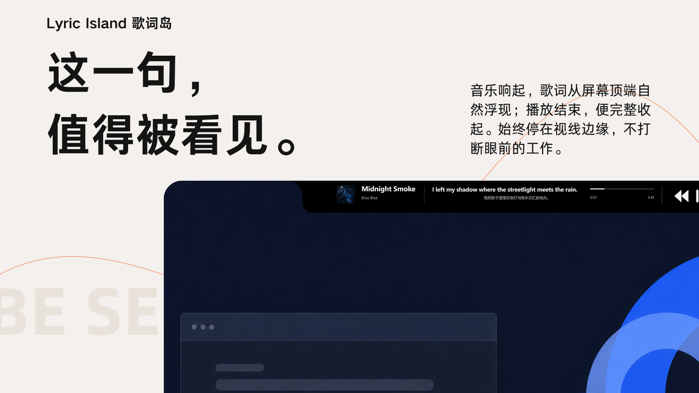
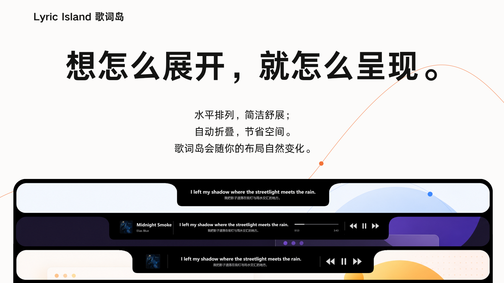
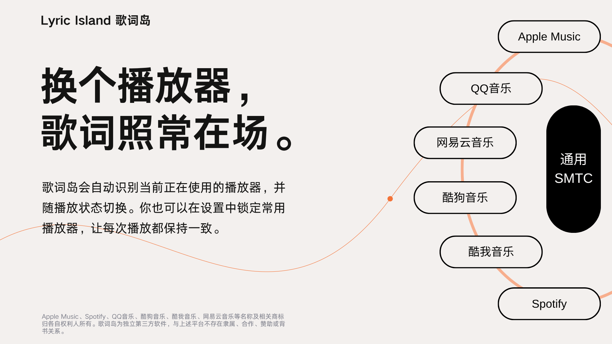

# LyricHover | LyricHover

[English](README_EN.md) · [下载发布版本](https://apps.microsoft.com/detail/9NRXZP5HMXK2) · [官方网站](https://lyric-island.top/) · [问题反馈](https://lyric-island.top/incentives/) · [GitHub Issues](https://github.com/BochengYao/LyricIsland/issues)

> 这一句，值得被看见。

LyricHover | LyricHover 是一款为 Windows 10/11 打造的顶部动态歌词工具。音乐响起，歌词从屏幕顶端自然浮现；播放结束，LyricHover完整收起。它通过 Windows 原生媒体会话连接你正在使用的播放器，从多个歌词来源匹配同步歌词与翻译，并把歌词、封面、歌曲信息、播放控制和进度组合成一座真正属于你的LyricHover。

它不再只为 Apple Music 工作。QQ 音乐、网易云音乐、酷狗音乐、酷我音乐、Spotify，以及 Apple Music，都可以在同一个轻盈、连贯的桌面体验中被识别和切换。



**[前往 Microsoft Store 下载发布版本 →](https://apps.microsoft.com/detail/9NRXZP5HMXK2)**

> **下载说明：** [GitHub Releases](https://github.com/BochengYao/LyricIsland/releases/tag/v1.0.0) 中提供的安装包仅为早期 Demo，不代表当前正式版本。当前正式版本请前往 [Microsoft Store](https://apps.microsoft.com/detail/9NRXZP5HMXK2) 下载。

## 一眼了解 LyricHover

- **始终在场，不打断工作。** 歌词贴合屏幕顶边出现，需要时展开，不播放时自然收起。
- **换个播放器，歌词照常在场。** 自动识别当前音乐播放器，也可以优先选择你常用的播放器。
- **想怎么展开，就怎么呈现。** 六种模块、两种布局、独立的紧凑与展开组合，都可以直接在真实LyricHover上调整。
- **鼠标靠近，内容仍是主角。** 只淡化指针附近的区域，让下方内容保持可读、可操作。
- **歌词与翻译更可靠。** 多来源自动回退、智能翻译复用、稳定缓存与时间轴补偿共同减少缺词、闪烁和不同步。
- **主体功能始终免费。** 你可以自愿加入 LyricHover Pro 支持计划，帮助LyricHover继续生长。

## 视觉预览

<table>
  <tr>
    <td width="50%"></td>
    <td width="50%"></td>
  </tr>
  <tr>
    <td align="center"><strong>鼠标靠近，内容仍是主角。</strong></td>
    <td align="center"><strong>想怎么展开，就怎么呈现。</strong></td>
  </tr>
  <tr>
    <td width="50%"></td>
    <td width="50%"></td>
  </tr>
  <tr>
    <td align="center"><strong>一开场，就在场。</strong></td>
    <td align="center"><strong>换个播放器，歌词照常在场。</strong></td>
  </tr>
</table>

## v2.0 完整更新

### 全新的多播放器体验

- 不再只为 Apple Music 工作，新增对 QQ 音乐、网易云音乐、酷狗音乐、酷我音乐和 Spotify 媒体会话的识别与适配。
- 改用 Windows 原生媒体会话读取歌曲信息、封面、播放状态与时间轴，减少中间脚本带来的延迟。
- 自动选择 Windows 当前播放器或最近开始播放的音乐播放器。
- 支持“优先选择”指定播放器；目标播放器不可用时，仍可自动切换至其他正在播放的音乐播放器。
- 仅响应已识别的音乐播放器，网页视频、短视频和其他非音乐媒体不再唤出LyricHover。
- 新增上一首、播放、暂停和下一首控制模块。
- 新增播放进度与歌曲时长显示。
- 针对时间轴信息不完整的播放器，增加本地进度估算、暂停冻结、延迟补偿与时长回退。
- 修复播放器重复上报相同进度时，歌词与进度停止前进的问题。
- 修复轻微时间轴回跳导致歌词闪烁的问题，同时保留真正拖动进度后的大幅同步修正。
- 优化切歌响应，避免上一首歌曲的歌词或播放操作残留到新歌曲。

> **网易云音乐说明：** 受网易云音乐桌面版接口限制，在播放器内拖动进度条时，歌词进度仍无法实时同步；正常播放、切歌、歌词显示和播放控制不受影响。

### 全新的模块化LyricHover

- LyricHover现在由六种模块组成：歌词、专辑封面、歌曲信息、播放控制、播放进度和分割线。
- 新增“水平积木”布局，让所有模块像积木一样横向排列并始终完整显示。
- 新增“自动折叠”布局，平时保持紧凑，按下交互快捷键后展开完整内容。
- 紧凑状态与展开状态可以保存各自独立的模块组合。
- 可以从模块工具箱直接拖入模块。
- 支持在真实LyricHover上拖动、吸附和重新排序。
- 支持在同一布局中放入多个相同模块，包括多个分割线。
- 将模块拖出LyricHover即可删除；如果没有真正拖出，模块会自动恢复，避免误操作。
- 新增明确的插入位置与占位预览，让模块落点更直观。
- 支持保存、取消与关闭回退；未保存的布局不会覆盖原有设置。
- 可以调整歌词模块宽度。
- 可以调整分割线透明度与左右间距。
- 歌曲信息模块会根据歌名和歌手长度自动改变宽度，在减少留白的同时尽量完整显示长歌名。
- 专辑封面改为居中显示，并使用更自然的圆角裁切。
- 模块增加、删除、展开与宽度变化均加入连贯的尺寸动画。

### 更直接的展开与收起

- “自动折叠”模式不再需要先点击LyricHover。
- 按下“临时启用交互”快捷键，LyricHover会立即展开并进入可操作状态。
- 松开快捷键后，按照“展开停留”设置开始计时，再自动折叠。
- 新增可调节的“展开停留”时间。
- 新增可调节的“无播放后收起”时间。
- 关闭设置窗口或松开交互快捷键后，会重新开始“无播放后收起”计时。
- 编辑模块期间，LyricHover会保持展开，不会在操作中途收起。
- 播放控制按钮不会再被模块拖动操作拦截。
- 启动提示现在会自动开始收起计时，无需额外确认。
- 展开、收起与尺寸变化使用更自然的非线性动画。

### 更完整的快捷键

- 新增全局歌词提前快捷键。
- 新增全局歌词延后快捷键。
- 新增歌词时间偏移重置快捷键。
- 新增“临时启用交互”快捷键，默认使用 `Ctrl`。
- 所有快捷键均可在设置中重新绑定。
- 快捷键编辑方式调整为：单击输入框后，直接按下新的快捷键组合。
- 启用临时交互时会暂时关闭鼠标避让透明效果，方便点击岛内控件。

### 更可靠的歌词与翻译

- 优化多个歌词来源之间的自动回退与翻译优先选择。
- LRCLIB 按专辑搜索未命中时，会继续尝试范围更宽的匹配。
- 主歌词源无结果、返回异常或翻译不可用时，会自动尝试其他来源。
- 新增混音版、合作版等歌曲复用原版翻译的智能匹配。
- 仅在原文行高度匹配时复用翻译，避免将错误翻译拼接到不同版本。
- 自动过滤只有时间戳、没有实际内容的无效翻译。
- 修复切换至下一句歌词时重复使用上一句翻译的问题。
- 中文原文不会重复显示无意义的中文翻译；日文等其他语言仍可正常显示译文。
- 修复 LRC 中空时间标记造成两句歌词之间突然留白的问题。
- 修复同一句歌词播放切换动画后又闪回原句的问题。
- 优化含有 `feat.` 等合作歌手信息的歌曲标题匹配。
- 自动清理歌曲信息中误附加到歌手后的专辑名称。
- 移除容易产生旧歌词残留的播放器专用 OCR 回退。

### 更可靠的歌词缓存

- 修复播放器上报歌曲时长存在一至两秒误差时，已经缓存的歌词仍被重复下载的问题。
- 切回上一首歌曲时，会更稳定地复用本地歌词与翻译。
- 保留按歌曲管理的缓存与容量上限。
- 缓存设置增加更清晰的容量和清理说明。

### 更细腻的鼠标避让

- 保留并完善鼠标智能避让功能。
- 鼠标靠近时，只降低指针附近区域的背景与文字不透明度。
- 鼠标离开后，LyricHover会恢复完整不透明度。
- 支持调节探测范围、光晕大小、长宽比例与透明度变化。
- 新增更直观的长宽比例与透明度频谱预览。
- 新增交互穿透选项，同时保留左键拖动LyricHover的能力。
- 优化避让边缘的透明度过渡，让变化更加平滑。

### 重新设计的设置与教学

- 设置页面重新整理为歌词显示、位置与状态、缓存、鼠标避让、快捷键、模块布局和关于等清晰分类。
- 原“位置”页面更名为“位置与状态”，集中管理屏幕位置与自动收起行为。
- 深色、浅色和跟随系统外观重新适配。
- 选择“跟随系统”后，Windows 外观变化可以实时反映到设置界面。
- 分段选择控件增加更自然的切换动画。
- 新增完整的首次启动教学，并可随时重新播放。
- 教学会等待用户真正完成对应操作，再进入下一步。
- 教学模式增加退出、遮罩、高亮与操作提示优化。
- 教学中的“新功能”标记使用内置小赖字体，无需用户额外安装。
- 设置中加入[LyricHover官方网站](https://lyric-island.top/)入口。
- 意见反馈入口连接至官方[用户激励与反馈页面](https://lyric-island.top/incentives/)。
- 新增“支持开发者”页面，提供免费支持方式和 LyricHover Pro 支持计划。
- 关于页面移除 Beta 字样，正式显示当前版本信息。

### 品牌与稳定性

- 发布程序集和文件使用 `LyricHover.App`；为保证已有用户升级兼容，解决方案、项目目录、命名空间和本地数据目录继续保留 `LyricHover` 技术名称。
- 自动迁移旧版设置与歌词缓存，升级后无需重新配置。
- 设置文件改为安全替换写入，损坏的设置会先备份再恢复。
- 保持单实例运行，重复启动时会唤起现有LyricHover。
- 新增系统托盘入口。
- 优化媒体会话订阅、窗口关闭清理与后台资源释放。
- 合并重复动画和鼠标采样，减少不必要的界面刷新。
- 未发生变化的模块不再重复渲染，提升长时间运行时的稳定性。
- 完成 Microsoft Store 产品身份与 MSIX 安装包适配。

### LyricHover Pro

LyricHover主体功能始终免费。Pro 是自愿加入的支持计划，用于支持持续开发，并提供支持者徽章与新功能优先体验。

- 已拥有 Microsoft Store Pro 加载项的用户会自动识别为 Pro。
- 在北京时间 `2026-07-30 00:00` 前正式购买 v1、且不是试用许可的用户，会在 v2 中自动激活同等 Pro 权益。
- Pro 权益通过 Microsoft Store 当前账号验证；断网时会沿用最近一次成功验证结果。
- 自动迁移只影响应用内权益，不会在 Microsoft Store 中伪造一笔新的加载项购买记录。

## 播放器兼容性

| 播放器 | 媒体会话识别 | 说明 |
|---|---:|---|
| Apple Music | ✓ | 支持歌曲信息、封面、播放状态、时间轴与播放控制。 |
| QQ 音乐 | ✓ | 支持已发布到 Windows 媒体会话的信息与控制能力。 |
| 网易云音乐 | ✓ | 正常播放、切歌、歌词显示和控制可用；播放器内拖动进度无法实时同步歌词。 |
| 酷狗音乐 | ✓ | 支持已发布到 Windows 媒体会话的信息与控制能力。 |
| 酷我音乐 | ✓ | 支持已发布到 Windows 媒体会话的信息与控制能力。 |
| Spotify | ✓ | 支持已发布到 Windows 媒体会话的信息与控制能力。 |

播放器对封面、时间轴、时长和控制接口的实现并不完全一致。更细的实机结果见[播放器测试矩阵](docs/testing/v2-beta1-player-matrix.md)。LyricHover仅响应已识别的音乐播放器，不会因为网页视频、短视频或其他非音乐媒体会话而弹出。

## 安装与使用

### 从 Microsoft Store 安装

新版本统一通过 [Microsoft Store](https://apps.microsoft.com/detail/9NRXZP5HMXK2) 发布。安装后，从开始菜单打开 LyricHover，并在任一受支持播放器中开始播放音乐。GitHub Releases 中保留的安装包仅供早期 Demo 体验。

首次启动会进入教学模式。右键LyricHover或通过系统托盘可以打开设置。

### 默认全局快捷键

| 快捷键 | 功能 |
|---|---|
| `Ctrl` | 临时启用交互并展开自动折叠布局 |
| `Ctrl+Alt+Left` | 歌词提前 500 ms |
| `Ctrl+Alt+Right` | 歌词延后 500 ms |
| `Ctrl+Alt+Down` | 重置歌词时间偏移 |

所有快捷键都可以重新绑定。单击快捷键输入框后，直接按下新的快捷键组合即可。

## 歌词来源与隐私

LyricHover支持 LRCLIB、QQ 音乐、酷狗音乐和网易云音乐等歌词来源，并只会发送匹配歌词所需的歌曲标题、歌手、专辑和时长等信息。歌词内容与接口由相应第三方提供，使用时请同时遵守其服务条款。

设置、歌词缓存与 Pro 验证结果保存在本地：

```text
%LOCALAPPDATA%\LyricHover\settings.json
%LOCALAPPDATA%\LyricHover\lyrics\
%LOCALAPPDATA%\LyricHover\pro-entitlement.json
```

程序会自动迁移旧版 `%LOCALAPPDATA%\LyricHover\` 中的设置与缓存。Pro 验证缓存不保存 Microsoft Store 令牌。桌面端不要求注册LyricHover账号。

## 从源码运行

环境要求：

- Windows 10/11 x64
- Git
- 能够构建 `netcoreapp3.1` WPF 项目的 .NET SDK
- Windows 10 SDK `10.0.19041` 或兼容版本

```powershell
git clone https://github.com/BochengYao/LyricIsland.git
cd LyricHover
dotnet restore LyricHover.sln
.\run.ps1
```

### 构建与验证

```powershell
$env:TargetPlatformSdkPath='C:\Program Files (x86)\Windows Kits\10\'
$env:TargetPlatformDisplayName='Windows'

dotnet restore --runtime win-x64 LyricHover.App\LyricHover.App.csproj
dotnet run --no-restore --configuration Release --project LyricHover.Tests
dotnet build --no-restore --configuration Release LyricHover.sln
.\publish.ps1 -KeepVersion -NoLaunch
```

发布入口为 `publish\current\LyricHover.App.exe`。Microsoft Store 使用的自包含 MSIX 通过 `store\msix\build-msix.ps1` 单独生成。

## 项目结构

```text
LyricHover.App/    WPF 桌面应用、LyricHover窗口、设置与原生媒体会话
LyricHover.Core/   歌词匹配、解析、缓存、布局与通用业务逻辑
LyricHover.Tests/  轻量自动化回归测试入口
store/               Microsoft Store 身份、资源与 MSIX 构建脚本
docs/                设计、计划、兼容性矩阵与项目资料
website/             LyricHover 官方网站与相关 API
视觉宣传/            中文、英文宣传海报与无文字背景
```

面向用户的产品名为 **LyricHover | LyricHover**。为兼容既有设置、缓存与 Store 更新，解决方案、项目目录、命名空间和本地数据目录保留 `LyricHover`；发布程序集与文件使用 `LyricHover.App`。

## 参与与支持

- 遇到问题时，请在 [Issues](https://github.com/BochengYao/LyricIsland/issues) 中附上 Windows 版本、播放器名称、歌词源和复现步骤。
- 播放器兼容性反馈请分别说明封面、时间轴、播放控制、切歌和进度跳转是否有效。
- 产品建议和活动反馈可以通过[用户激励与反馈页面](https://lyric-island.top/incentives/)提交。
- 大改动建议先开 Issue 讨论，避免实现方向与现有设计冲突。

## 开源许可证

本项目采用 GNU General Public License v3.0 only（GPL-3.0-only）开源许可。详情请参阅 GitHub 主分支中的 [LICENSE](https://github.com/BochengYao/LyricIsland/blob/main/LICENSE)。

## 说明

LyricHover / LyricHover是独立项目，与 Apple、腾讯、网易、酷狗、酷我、Spotify 及其音乐服务不存在隶属、合作或背书关系。相关名称与商标归各自权利人所有。歌词内容来自第三方歌词服务，使用时请尊重内容版权与服务条款。

© 2026 LyricHover · LyricHover
