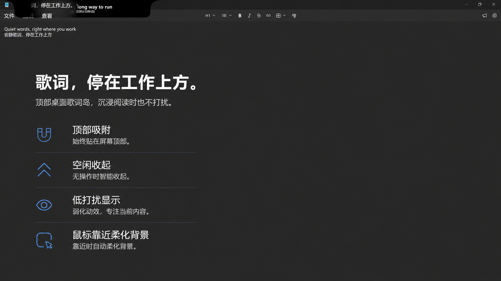
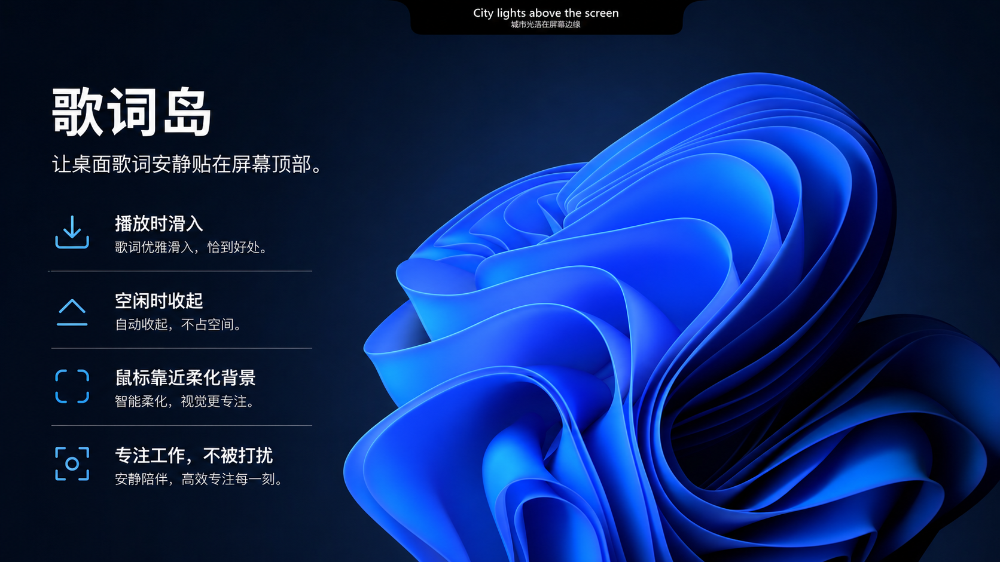

# Lyric Island

[中文](README.md) · [Website](https://lyric-island.top) · [Releases](https://github.com/BochengYao/LyricIsland/releases) · [Issues](https://github.com/BochengYao/LyricIsland/issues)

> Lyrics that feel like a quiet, native part of your Windows desktop.

Lyric Island is a desktop lyrics companion for Windows. It reads the active track through Windows system media sessions, matches synced lyrics and source-provided translations from multiple providers, and presents them in a top-edge island that slides in, expands, and retracts with playback.

The project is no longer centered on a single music client. If a player publishes a usable Windows SMTC session, Lyric Island can attempt to read its metadata and playback state.

> **Project status:** v2.0 Beta is under active development. Development branches may be ahead of GitHub Releases, and some player-specific behavior and interactions are still awaiting live verification.

## Preview





## Highlights

### Top-edge lyric island

- Slides down from the top edge during playback and retracts when playback pauses or stops.
- Supports persistent, auto-hidden, and hover-expanded interaction states.
- Can be positioned on a selected monitor, edge, and horizontal anchor for multi-monitor desktops.

### Modular layouts

v2.0 Beta composes the island from reusable modules:

- Album artwork
- Lyrics
- Track information
- Playback controls
- Playback progress
- Dividers

The settings window includes a module toolbox. Modules can be dragged onto the real island, snapped into place, reordered, saved, or cancelled. Compact and expanded layouts are stored independently.

### Multiple Windows media players

Lyric Island reads Windows SMTC sessions, follows the most recently active player automatically, or locks to a selected player. Target players include:

- Apple Music
- QQ Music
- NetEase Cloud Music
- KuGou Music
- KuWo Music
- Spotify
- Other Windows SMTC-compatible players

Artwork, timeline, transport controls, and seeking support vary by player. Only observed results are recorded in the [player validation matrix](docs/testing/v2-beta1-player-matrix.md); unverified behavior is not presented as fully supported.

### Multiple lyric providers and synced translations

- Supports LRCLIB, QQ Music, KuGou, NetEase, and fallback matching.
- Allows a preferred provider while temporarily trying other providers when it cannot match the current track.
- Uses line-synced lyrics and Chinese translations already supplied by lyric providers.
- Does not generate machine translations locally.

### Lyric presentation details

- Single-line and multi-line layouts.
- Translation mode automatically uses the multi-line layout.
- Long lyric lines scroll across their display duration instead of being truncated with ellipses.
- Global lyric timing can be adjusted and calibrated immediately with shortcuts.

### Cursor-aware transparency

When the pointer approaches the island, only the nearby region becomes more transparent, keeping the content underneath readable and clickable. Detection distance, aura size, aspect ratio, and opacity spectrum are configurable.

### Preferences, caching, and single-instance behavior

- Light, dark, and system theme modes.
- Controls for lyrics, player locking, module layout, screen placement, and cursor avoidance.
- Configurable song-level LRU lyric cache.
- Repeated launches reuse the running instance instead of opening duplicate islands.

## Quick start

### Download a release

Download a package from [GitHub Releases](https://github.com/BochengYao/LyricIsland/releases), extract it, and run `LyricIsland.App.exe`.

The latest public release may lag behind the v2.0 Beta development branch. Build from source to inspect the latest development state.

### Run from source

Requirements:

- Windows 10/11 x64
- Git
- A .NET SDK capable of building `netcoreapp3.1` WPF projects
- Windows 10 SDK `10.0.19041` or a compatible version

```powershell
git clone https://github.com/BochengYao/LyricIsland.git
cd LyricIsland
dotnet restore
.\run.ps1
```

Start playback in any Windows SMTC-compatible player. The first launch presents a short guide; right-click the island to open settings.

### Publish locally

```powershell
dotnet publish `
  .\LyricsIsland.App\LyricsIsland.App.csproj `
  -c Release `
  -r win-x64 `
  --self-contained false `
  -o .\publish\current
```

The published entry point is:

```text
publish\current\LyricsIsland.App.exe
```

## Controls and shortcuts

When the island is focused:

| Input | Action |
|---|---|
| `Right` / `Up` | Move lyrics 200 ms earlier |
| `Left` / `Down` | Move lyrics 200 ms later |
| `R` | Reset the default lyric offset |
| Right-click the island | Open settings |

Default global shortcuts:

| Shortcut | Action |
|---|---|
| `Ctrl+Alt+Left` | Decrease lyric offset by 500 ms |
| `Ctrl+Alt+Right` | Increase lyric offset by 500 ms |
| `Ctrl+Alt+Down` | Reset lyric offset |

Shortcuts can be changed in settings. Rebind them if another application already uses the same combination.

## Local data and privacy

Lyric Island stores settings and cached lyrics locally:

```text
%LOCALAPPDATA%\LyricsIsland\settings.json
%LOCALAPPDATA%\LyricsIsland\lyrics\
```

On first use of the new directory, the application automatically migrates legacy settings and cached lyrics. The desktop application does not require a Lyric Island account. Lyric lookup sends the minimum matching metadata, such as track title and artist, to the enabled third-party lyric providers. Their respective terms still apply.

## Repository layout

```text
LyricsIsland.App/    WPF desktop app, island UI, settings, and media sessions
LyricsIsland.Core/   Lyric matching, parsing, caching, layouts, and shared logic
LyricsIsland.Tests/  Lightweight automated regression entry point
docs/                           Design notes, plans, validation matrices, and project material
website/                        Lyric Island website and APIs on the v2 development branch
```

The solution, project directories, namespaces, assemblies, and published files consistently use `LyricsIsland`. The user-facing product name is **Lyric Island / 歌词岛**.

## Validation

```powershell
$env:TargetPlatformSdkPath='C:\Program Files (x86)\Windows Kits\10\'
$env:TargetPlatformDisplayName='Windows'

dotnet run --no-restore --configuration Release --project LyricsIsland.Tests
dotnet build LyricsIsland.sln -c Release --no-restore
git diff --check
```

Player integration also requires live testing in a normal Windows desktop session. Automated tests cannot replace the metadata, artwork, timeline, and transport behavior published by a real player.

## Contributing

- When reporting a problem in [Issues](https://github.com/BochengYao/LyricIsland/issues), include the Windows version, player, lyric provider, and reproduction steps.
- For player compatibility reports, describe artwork, timeline, play/pause, previous/next, and seeking separately.
- Please discuss large changes in an Issue first so they can remain aligned with the existing v2 design.

## Disclaimer

Lyric Island is an independent project and is not affiliated with or endorsed by Apple, Tencent, NetEase, KuGou, KuWo, Spotify, or their music services. Product names and trademarks belong to their respective owners. Lyrics are obtained from third-party lyric services; please respect content rights and provider terms.

© 2026 Lyric Island · 歌词岛
