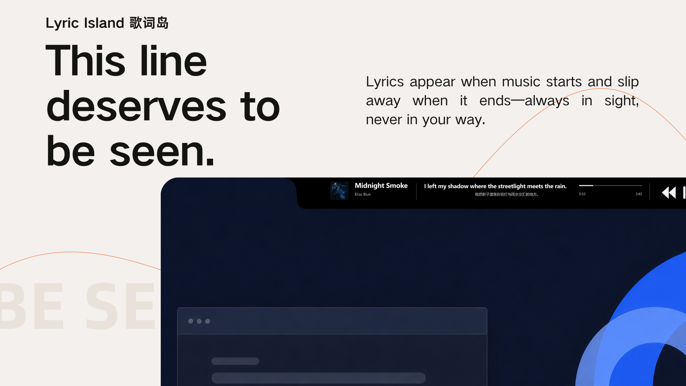
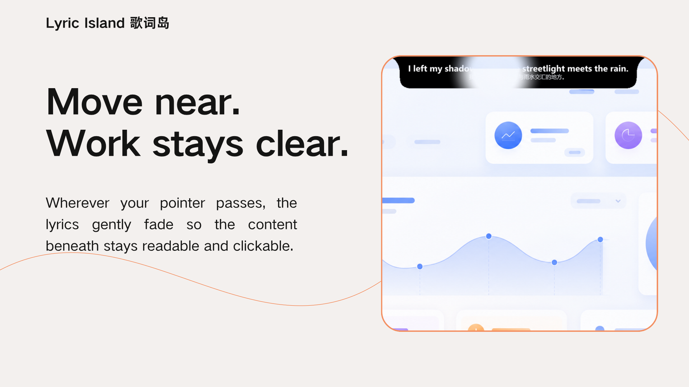
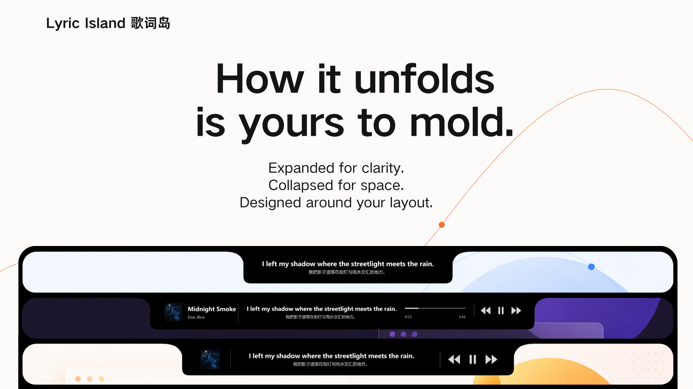
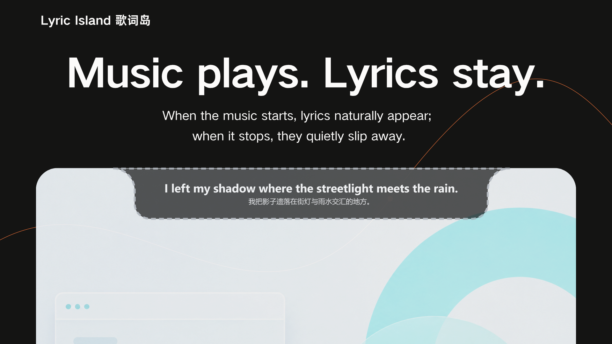
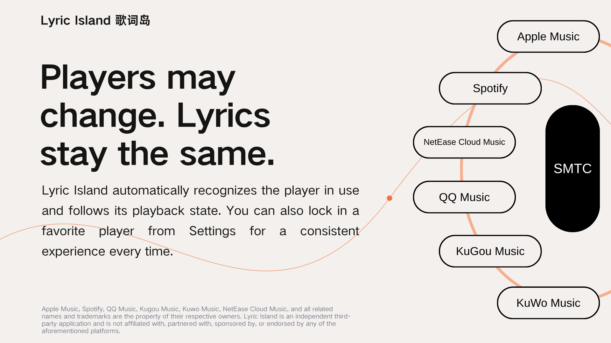

# LyricHover

[中文](README.md) · [Download the release](https://apps.microsoft.com/detail/9NRXZP5HMXK2) · [Website](https://lyric-island.top/en/) · [Feedback](https://lyric-island.top/en/incentives/) · [GitHub Issues](https://github.com/BochengYao/LyricIsland/issues)

> This line deserves to be seen.

LyricHover is a top-edge lyrics experience made for Windows 10 and 11. When music starts, lyrics appear naturally. When it ends, the island slips away. It connects to the player you are already using through native Windows media sessions, finds synced lyrics and translations across multiple providers, and brings lyrics, artwork, track details, playback controls, and progress together in one fluid island.

It is no longer built around Apple Music alone. Apple Music, QQ Music, NetEase Cloud Music, KuGou Music, KuWo Music, and Spotify can all be recognized and followed through the same calm, consistent desktop experience.



**[Download the release from Microsoft Store →](https://apps.microsoft.com/detail/9NRXZP5HMXK2)**

## LyricHover at a glance

- **Always in sight. Never in your way.** The island rests against the top edge, expands when you need it, and retracts when the music stops.
- **Players may change. Lyrics stay.** Follow the active music player automatically, or give your favorite player priority.
- **How it unfolds is yours to mold.** Six modules, two layout modes, and separate compact and expanded compositions—all edited on the real island.
- **Move near. Work stays clear.** Only the region around your pointer fades, keeping what is underneath readable and clickable.
- **Lyrics and translations that hold together.** Multi-source fallback, careful translation reuse, reliable caching, and timeline compensation reduce missing lines, flicker, and drift.
- **The core experience stays free.** LyricHover Pro is an optional way to support continued development.

## Gallery

<table>
  <tr>
    <td width="50%"></td>
    <td width="50%"></td>
  </tr>
  <tr>
    <td align="center"><strong>Move near. Work stays clear.</strong></td>
    <td align="center"><strong>How it unfolds is yours to mold.</strong></td>
  </tr>
  <tr>
    <td width="50%"></td>
    <td width="50%"></td>
  </tr>
  <tr>
    <td align="center"><strong>Music plays. Lyrics stay.</strong></td>
    <td align="center"><strong>Players may change. Lyrics stay the same.</strong></td>
  </tr>
</table>

## Everything new in v2.0

### A new multi-player experience

- LyricHover no longer works with Apple Music alone. It now recognizes and adapts to media sessions from QQ Music, NetEase Cloud Music, KuGou Music, KuWo Music, and Spotify.
- Track metadata, artwork, playback state, and timeline data now come directly from native Windows media sessions, reducing the delay introduced by intermediary scripts.
- LyricHover can automatically follow the current Windows media player or the music player that most recently started playback.
- A chosen player can be marked as preferred. If it is unavailable, LyricHover can still switch to another music player that is currently playing.
- Only recognized music players can reveal the island. Web videos, short-form video apps, and other non-music media sessions no longer summon it.
- New modules provide previous, play, pause, and next controls.
- Playback progress and total track duration can now be displayed.
- Players with incomplete timeline data gain local progress estimation, pause freezing, latency compensation, and duration fallback.
- Fixed lyrics and progress stopping when a player repeatedly reports the same position.
- Fixed small backward timeline jumps causing lyric flicker, while preserving large corrections after a real seek.
- Track changes respond more cleanly, preventing lyrics or playback actions from the previous track from leaking into the next one.

> **A note about NetEase Cloud Music:** the NetEase desktop app does not expose live seek changes through its current interface, so dragging its in-player progress bar cannot update lyric progress in real time. Normal playback, track changes, lyric display, and playback controls are unaffected.

### A fully modular LyricHover

- The island is now built from six module types: lyrics, album artwork, track information, playback controls, playback progress, and dividers.
- The new **Horizontal Blocks** layout keeps every module arranged in one complete horizontal row.
- The new **Auto Collapse** layout stays compact by default and reveals the full composition when the interaction shortcut is held.
- Compact and expanded states can store independent module combinations.
- Modules can be dragged directly from the module toolbox.
- Modules can be moved, snapped, and reordered on the real island.
- The same module can appear more than once in a layout, including multiple dividers.
- Drag a module outside the island to remove it. If it was not truly dragged out, it returns automatically to prevent accidental deletion.
- Clear insertion markers and placeholders make every drop position easier to understand.
- Save, cancel, and close-to-revert flows are supported. Unsaved layouts never overwrite the last saved composition.
- The lyric module width is adjustable.
- Divider opacity and left/right spacing are adjustable.
- The track information module adapts to title and artist length, reducing empty space while keeping long titles as complete as possible.
- Album artwork is centered and clipped with a more natural corner radius.
- Adding, removing, expanding, and resizing modules now uses continuous size animation.

### A more direct way to expand and retract

- Auto Collapse no longer requires a click on the island first.
- Hold the **Temporary Interaction** shortcut and the island immediately expands into an interactive state.
- Release the shortcut and the configured **Expanded Hold** countdown begins before the island collapses.
- Expanded Hold duration is adjustable.
- The **Retract After No Playback** delay is adjustable.
- Closing Settings or releasing the interaction shortcut restarts the no-playback countdown.
- The island stays expanded while modules are being edited.
- Playback buttons are no longer intercepted by module-drag operations.
- The startup hint now starts its own retract countdown without requiring confirmation.
- Reveal, retract, and resize transitions use more natural nonlinear motion.

### More complete shortcuts

- A global shortcut can move lyrics earlier.
- A global shortcut can move lyrics later.
- A global shortcut can reset lyric timing offset.
- A new **Temporary Interaction** shortcut uses `Ctrl` by default.
- Every shortcut can be rebound in Settings.
- Shortcut editing is now direct: click a shortcut field, then press the new key combination.
- Temporary interaction briefly suppresses cursor-avoidance transparency so controls inside the island remain easy to click.

### More reliable lyrics and translations

- Automatic fallback and translation preference are improved across lyric providers.
- If an album-scoped LRCLIB search misses, LyricHover continues with a broader match.
- If the primary provider returns no lyrics, fails, or has no usable translation, other providers are tried automatically.
- Remixes, collaborations, and similar variants can intelligently reuse a matching original translation.
- A translation is reused only when the source lines match closely enough, preventing unrelated versions from being stitched together.
- Translation files containing timestamps but no real text are filtered out automatically.
- Fixed the previous line's translation being reused after moving to the next lyric.
- Chinese source lyrics no longer repeat a meaningless Chinese translation; translations for Japanese and other languages remain available.
- Fixed empty LRC timestamp markers creating sudden blank gaps between lyric lines.
- Fixed the current lyric animating forward and then flashing back to the same line.
- Improved title matching for tracks containing featured-artist labels such as `feat.`.
- Album names accidentally appended to artist metadata are removed automatically.
- Removed player-specific OCR fallback that could leave stale lyrics on screen.

### More reliable lyric caching

- Cached lyrics are no longer downloaded again just because a player reports a one- or two-second duration difference.
- Returning to the previous track more reliably reuses local lyrics and translations.
- Song-level cache management and the configurable capacity limit remain available.
- Cache settings now explain capacity and cleanup behavior more clearly.

### More refined cursor avoidance

- Smart cursor avoidance remains a first-class feature and has been further refined.
- When the pointer approaches, only the nearby background and text become more transparent.
- Full opacity returns when the pointer leaves.
- Detection distance, aura size, aspect ratio, and opacity response are adjustable.
- New aspect-ratio and opacity-spectrum previews make the effect easier to tune.
- A click-through option is available without taking away left-button island dragging.
- Smoother falloff at the edge of the avoidance area makes every transition feel more natural.

### Redesigned Settings and onboarding

- Settings are reorganized into clear sections for Lyrics, Position & State, Cache, Cursor Avoidance, Shortcuts, Module Layout, and About.
- The former Position page is now **Position & State**, bringing placement and automatic retraction controls together.
- Light, dark, and system appearance modes have been redesigned.
- In system mode, Windows appearance changes are reflected in Settings in real time.
- Segmented controls now animate between selections more naturally.
- A complete first-launch tutorial has been added and can be replayed at any time.
- The tutorial waits for the user to actually complete each action before advancing.
- Exit behavior, masking, highlights, and action guidance are improved throughout tutorial mode.
- The tutorial's **New Feature** marker uses the bundled Xiaolai typeface; no separate font installation is required.
- Settings now includes a direct link to the English [LyricHover website](https://lyric-island.top/en/).
- Feedback opens the English [rewards and feedback page](https://lyric-island.top/en/incentives/).
- A new Support the Developer page offers free ways to help and the optional LyricHover Pro support plan.
- The About page no longer shows the Beta label and now presents the current version directly.

### Brand and stability

- Published assemblies and files use `LyricHover.App`; solution paths, namespaces, and local data keep the technical `LyricHover` name for upgrade compatibility.
- Legacy settings and lyric caches migrate automatically, so upgrading does not require reconfiguration.
- Settings are written through safe file replacement; damaged settings are backed up before recovery.
- LyricHover remains single-instance. Launching it again activates the existing island instead of opening a duplicate.
- A system tray entry has been added.
- Media-session subscriptions, window shutdown, and background resource cleanup are more robust.
- Repeated animations and pointer samples are coalesced to reduce unnecessary UI work.
- Modules that have not changed are no longer rendered again, improving stability during long sessions.
- Microsoft Store identity and MSIX packaging are fully integrated.

### LyricHover Pro

The core LyricHover experience stays free. Pro is an optional support plan that helps fund continued development and includes a supporter badge plus early access to new features.

- Owners of the Microsoft Store Pro durable add-on are recognized automatically.
- Anyone who made a full, non-trial v1 purchase before `2026-07-30 00:00` China Standard Time receives equivalent Pro access in v2 automatically.
- Pro status is verified against the current Microsoft Store account. When offline, LyricHover keeps the most recent successfully verified Pro state.
- Legacy migration grants the same in-app access but does not fabricate a new add-on transaction in Microsoft Store.

## Player compatibility

| Player | Media-session recognition | Notes |
|---|---:|---|
| Apple Music | ✓ | Track metadata, artwork, playback state, timeline data, and playback controls are supported. |
| QQ Music | ✓ | Uses the metadata and controls the player publishes through Windows media sessions. |
| NetEase Cloud Music | ✓ | Normal playback, track changes, lyrics, and controls work; in-player seeking cannot update lyrics in real time. |
| KuGou Music | ✓ | Uses the metadata and controls the player publishes through Windows media sessions. |
| KuWo Music | ✓ | Uses the metadata and controls the player publishes through Windows media sessions. |
| Spotify | ✓ | Uses the metadata and controls the player publishes through Windows media sessions. |

Players do not expose artwork, timeline, duration, and transport capabilities in exactly the same way. See the [player validation matrix](docs/testing/v2-beta1-player-matrix.md) for detailed live-test results. LyricHover responds only to recognized music players, so web video, short-form video, and unrelated media sessions do not make the island appear.

## Install and use

### Get it from Microsoft Store

Get LyricHover from the [Microsoft Store](https://apps.microsoft.com/detail/9NRXZP5HMXK2). Open it from the Start menu, then begin playback in any supported music player.

The first launch opens the guided tutorial. Right-click the island or use the system tray icon to open Settings.

### Default global shortcuts

| Shortcut | Action |
|---|---|
| `Ctrl` | Temporarily enable interaction and expand Auto Collapse |
| `Ctrl+Alt+Left` | Move lyrics 500 ms earlier |
| `Ctrl+Alt+Right` | Move lyrics 500 ms later |
| `Ctrl+Alt+Down` | Reset lyric timing offset |

Every shortcut can be rebound. Click a shortcut field, then press the new key combination directly.

## Lyric providers and privacy

LyricHover can search LRCLIB, QQ Music, KuGou Music, NetEase Cloud Music, and other configured providers. It sends only the metadata needed for matching, such as title, artist, album, and duration. Lyrics and provider APIs remain subject to their respective terms.

Settings, lyric caches, and the latest Pro verification result are stored locally:

```text
%LOCALAPPDATA%\LyricHover\settings.json
%LOCALAPPDATA%\LyricHover\lyrics\
%LOCALAPPDATA%\LyricHover\pro-entitlement.json
```

Settings and caches from `%LOCALAPPDATA%\LyricHover\` are migrated automatically. The Pro verification cache contains no Microsoft Store token. The desktop app does not require a LyricHover account.

## Run from source

Requirements:

- Windows 10/11 x64
- Git
- A .NET SDK capable of building `netcoreapp3.1` WPF projects
- Windows 10 SDK `10.0.19041` or a compatible version

```powershell
git clone https://github.com/BochengYao/LyricIsland.git
cd LyricHover
dotnet restore LyricHover.sln
.\run.ps1
```

### Build and validate

```powershell
$env:TargetPlatformSdkPath='C:\Program Files (x86)\Windows Kits\10\'
$env:TargetPlatformDisplayName='Windows'

dotnet restore --runtime win-x64 LyricHover.App\LyricHover.App.csproj
dotnet run --no-restore --configuration Release --project LyricHover.Tests
dotnet build --no-restore --configuration Release LyricHover.sln
.\publish.ps1 -KeepVersion -NoLaunch
```

The published entry point is `publish\current\LyricHover.App.exe`. The self-contained Microsoft Store MSIX is built separately with `store\msix\build-msix.ps1`.

## Repository layout

```text
LyricHover.App/    WPF desktop app, island UI, Settings, and native media sessions
LyricHover.Core/   Lyric matching, parsing, caching, layouts, and shared logic
LyricHover.Tests/  Lightweight automated regression test entry point
store/               Microsoft Store identity, assets, and MSIX build scripts
docs/                Design notes, plans, compatibility matrices, and project material
website/             LyricHover website and related APIs
视觉宣传/            Chinese and English campaign artwork plus text-free backgrounds
```

The user-facing name is **LyricHover | LyricHover**. For upgrade compatibility, the solution, project folders, namespaces, and local data retain `LyricHover`; published assemblies and files use `LyricHover.App`.

## Contributing and support

- When reporting a problem in [Issues](https://github.com/BochengYao/LyricIsland/issues), include your Windows version, player, lyric provider, and reproduction steps.
- For player compatibility reports, describe artwork, timeline, playback controls, track changes, and seeking separately.
- Product ideas and campaign feedback can be submitted through the English [rewards and feedback page](https://lyric-island.top/en/incentives/).
- Please discuss large changes in an Issue first so they remain aligned with the current design.

## License

This project is licensed under the GNU General Public License v3.0 only (GPL-3.0-only). See [LICENSE](https://github.com/BochengYao/LyricIsland/blob/main/LICENSE) on the main branch.

## Disclaimer

LyricHover is an independent project and is not affiliated with, partnered with, sponsored by, or endorsed by Apple, Tencent, NetEase, KuGou, KuWo, Spotify, or their music services. Product names and trademarks belong to their respective owners. Lyrics come from third-party lyric services; please respect content rights and provider terms.

© 2026 LyricHover · LyricHover
